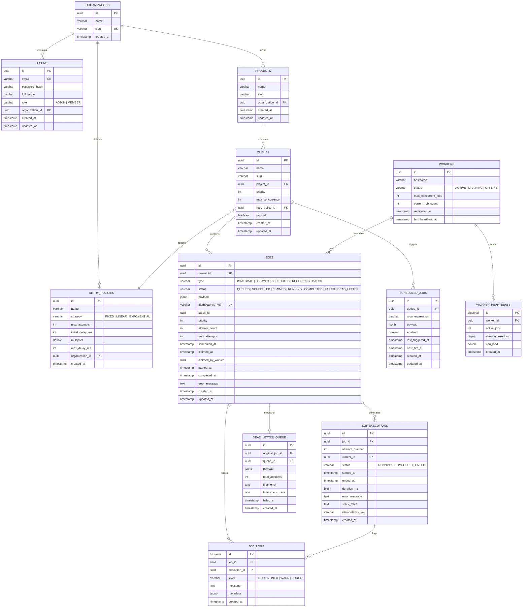

# Entity-Relationship Diagram

This document contains the visual representation and column details of the database schema.

## Mermaid ER Diagram

## Critical Database Indexes

The schema contains the following specialized indexes to ensure high performance on hot execution and query paths:

1. **`idx_jobs_claimable`**:
   - Query: Polling for jobs where `status = 'QUEUED'`.
   - Index: `CREATE INDEX idx_jobs_claimable ON jobs (queue_id, priority DESC, created_at ASC) WHERE status = 'QUEUED';`
2. **`idx_jobs_scheduled`**:
   - Query: Promoting due scheduled jobs where `status = 'SCHEDULED'`.
   - Index: `CREATE INDEX idx_jobs_scheduled ON jobs (scheduled_at) WHERE status = 'SCHEDULED' AND scheduled_at IS NOT NULL;`
3. **`idx_scheduled_jobs_fire`**:
   - Query: Polling for due cron schedules.
   - Index: `CREATE INDEX idx_scheduled_jobs_fire ON scheduled_jobs (next_fire_at) WHERE enabled = TRUE;`
4. **`idx_workers_status`**:
   - Query: Heartbeat checks for active workers.
   - Index: `CREATE INDEX idx_workers_status ON workers (status, last_heartbeat_at) WHERE status = 'ACTIVE';`
